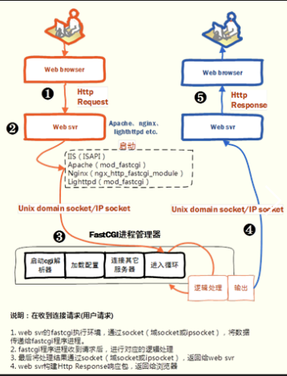

<h2>LNMP中 N 与 P 交互</h2>
 
 一、
 
        N :nginx    
        P :php

 二、CGI，FastCGI，PHP-FPM

    1.什么是CGI？

            CGI是一种通用网关协议。为了解决不同的语言解释器(如php、python解释器)与WebServer的通信而产生的一种协议。只要遵守这种协议就能实现语言与WebServer通讯。CGI是规定了要传什么数据／以什么格式传输给php解析器的协议。
            问题：
            有了cgi协议，解决了php解释器与webserver通信的问题，webserver终于可以处理动态语言了。但是，webserver每收到一个请求，都会去fork一个cgi进程，请求结束再kill掉这个进程。这样有10000个请求，就需要fork、kill php-cgi进程10000次。资源浪费。

    2.什么是FastCGI?

        是一种对CGI协议升华的一种协议。FastCGI像是一个常驻(long-live)型的CGI，它可以一直执行着，只要激活后，不会每次都要花费时间去fork一次(这是CGI最为人诟病的fork-and-execute 模式)。它还支持分布式的运算, 即 FastCGI 程序可以在网站服务器以外的主机上执行并且接受来自其它网站服务器来的请求。

    3.什么是PHP-FPM?

        (PHP FastCGI Process Manager)，PHP-FPM是一个实现了Fastcgi协议的程序,用来管理Fastcgi起的进程的,即能够调度php-cgi进程的程序。并提供了进程管理的功能。进程包含 master 进程和 worker 进程两种进程。master进程只有一个，负责监听端口(默认9000)，接收来自 WebServer的请求，而 worker 进程则一般有多个(具体数量根据实际需要配置)，每个进程内部都嵌入了一个 PHP 解释器，是PHP代码真正执行的地方。

    4.FastCGI好在哪里？

        Fastcgi则会先fork一个master，解析配置文件，初始化执行环境，然后再fork多个worker。当请求过来时，master会传递给一个worker，然后立即可以接受下一个请求。这样就避免了重复的劳动，效率自然是高。而且当worker不够用时，master可以根据配置预先启动几个worker等着；当然空闲worker太多时，也会停掉一些，这样就提高了性能，也节约了资源。这就是Fastcgi的对进程的管理。大多数Fastcgi实现都会维护一个进程池。

三、nginx 与php的交互过程
  我们以用户访问index.php为例，服务器环境为LNMP:

    1.用户请求index.php时，首先到Nginx

    2.Nginx流程步骤：

      1) 根据配置查找路由
      2) 加载nginx的fast-cgi模块(FastCGI的Client),将根据fastcgi.conf文件中fastcgi_*配置参数值也一并加入转发任务中
      3) 根据nginx.conf文件fastcgi_pass配置将请求转发到127.0.0.1:9000。
    3.PHP-FPM操作：
         (1) PHP-FPM的master进程监听9000端口。
         (2) 收到请求后调用子进程来处理逻辑，PHP解释器解释PHP语法并返回给Nginx。
    4.Nginx操作：
        将响应返回给用户

        

Nginx 与 PHP 交互过程图

nginx与php-fpm的结合，完整的流程是这样的。

    www.example.com
            |
            |
        Nginx
            |
            |
    路由到www.example.com/index.php
            |
            |
    加载nginx的fast-cgi模块
            |
            |
    fast-cgi监听127.0.0.1:9000地址
            |
            |
    www.example.com/index.php请求到达127.0.0.1:9000
            |
            |
    php-fpm 监听127.0.0.1:9000
            |
            |
    php-fpm 接收到请求，启用worker进程处理请求
            |
            |
    php-fpm 处理完请求，返回给nginx
            |
            |
    nginx将结果通过http返回给浏览器

四、nginx 与php-fpm的配置

    server {
        listen       80;
        server_name  www.example.com;

        location / {
            root   /www/wwwroot/www/;
            index  index.php index.html index.htm;
            try_files $uri $uri/ /index.php$is_args$args;
        }

        error_page   500 502 503 504  /50x.html;
        location = /50x.html {
            root   /www/wwwroot/www/;
        }

        location ~ \.php$ {
            root           /www/wwwroot/www/;
            fastcgi_pass   127.0.0.1:9000;
            fastcgi_index  index.php;
            fastcgi_param  SCRIPT_FILENAME  $document_root$fastcgi_script_name;
            include        fastcgi_params;
        }
    }
    
五、参考文章   
    <a href="https://laravel-china.org/articles/13772/with-so-many-lnmp-do-you-really-understand-the-interaction-between-n-and-p">用了那么多 LNMP, 你真的了解 N 与 P 交互吗？</a> 
    <a href="https://www.imooc.com/article/19278">你确定你真的懂Nginx与PHP的交互？</a> 
    <a href="https://www.imooc.com/article/38194">深入理解PHP之：Nginx 与 FPM 的工作机制</a> 
    <a href="https://segmentfault.com/a/1190000007322358">Nginx+Php-fpm运行原理详解</a>  
    <a href="https://www.zhihu.com/question/30672017">知乎高票回答 </a>       

