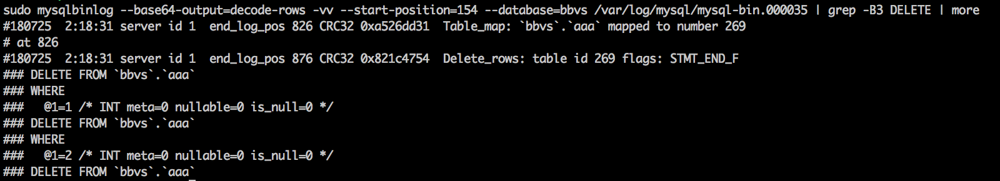
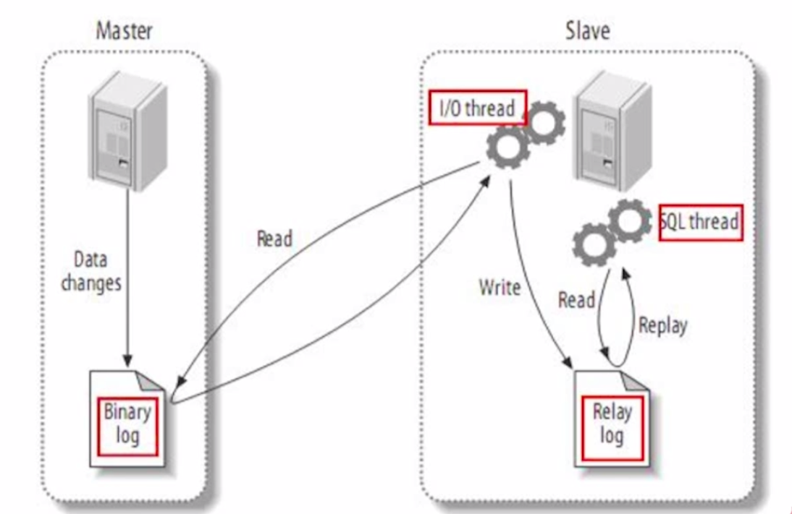

# MySQL Replication

## 数据库备份方案

### 场景(生产环境）

1. 误删（在同时连接多个数据库服务器时）跑路~
2. 程序存在漏洞导致被删库
3. 客户希望能够实时备份才放心

### 备份方案

1. 原有方案：每半小时进行一次数据库全备并上传到AWS S3上（只增不删，每天生成24G，每月生成720G的重复数据，浪费；没有开启二进制日志，半小时内的数据可能丢失）
2. 新方案：全备+实时备份二进制日志
 	* 每天凌晨2点进行一次数据库全备，并上传到AWS S3上
 	* 使用另一台AWS EC2远程实时复制master数据库的BinLog (简单）

3. demo

	* Mster创建全备用户和复制用户

	```
	create user 'backup'@'localhost' identified by '123456';
	
	grant select,reload,lock tables,replication client,show view,event,process on *.* to 'backup'@'localhost';
	
	```
	```
	grant replication slave on *.* to 'repl'@'IP地址' identified by '123456'	
	```

	* 开启Master二进制日志：修改MySQL配置文件

	```
	server-id		 = 1
	log_bin       = /var/log/mysql/mysql-bin
	binlog_do_db	 = bbvs
	```
	
	* 定时任务：使用mysqldump进行全备

	```
	mysqldump -ubackup -p --master-data=2 --single-transaction --routines --triggers --events bbvs > bbvs.sql
	```
	
	* 另一台服务器远程复制master的BinLog到当前目录

	```
	mysqlbinlog --raw --read-from-remote-server --stop-never --host 18.191.88.155 --port 3306 -urepl -p123456 mysql-bin.000001
	```
	
	* 后台运行repl.sh

	```
	nohup sh repl.sh &
	```

### 基于时间点的数据库恢复

2. 模拟恢复步骤
	* 备份Master数据库

	```
	mysqldump -ubackup -p --master-data=2 --single-transaction --routines --triggers --events bbvs > bbvs.sql
	```
	
	* 模拟数据库操作新增一张表并插入数据

	```
	create table aaa (`id` int(10) unsigned NOT NULL AUTO_INCREMENT primary key);
	insert into aaa(id) values (1),(2),(3),(5),(6);
	```

	* 模拟误删操作

	```
	delete from aaa where id in (1, 2, 3);
	```
	
	* 通过二进制日志获取全备份到指定误删时间点所做的修改
	* --start-position值以及mysql-bin.000003在全备sql文件中

	```
	sudo mysqlbinlog --base64-output=decode-rows -vv --start-position=154 --database=bbvs /var/log/mysql/mysql-bin.000035 | grep -B3 DELETE | more
	```

	
	
	从图中可以知道上次备份到现在的log_pos范围是：154 ~ 876, 所以只需要恢复这一段日志即可
	导出二进制文件到bbvs_diff.sql中：
	
	```
	sudo mysqlbinlog --start-position=154 --stop-position=876 --database=bbvs /var/log/mysql/mysql-bin.000035 > bbvs_diff.sql
	```
	
	* 全库恢复到备份时的数据

	```
	mysql -u root -p bbvs < bbvs.sql
	```
	
	* 导入数据：(由于在这个期间执行了create table操作，所以导出的二进制日志sql中也包含了建表语句，故先要删除原先的表后执行导入操作
	
	```
	drop table aaa;
	mysql -uroot -p bbvs < bbvs_diff.sql
	```

## 搭建主从结构

1. 配置Master

	* 开启binlog

	```
	//注释掉bind_address=127.0.0.1
	server-id		 = 1
	log_bin       = /var/log/mysql/mysql-bin
	binlog_do_db	 = bbvs
	```

	* 创建复制用户repl

	```
	grant replication slave on *.* to 'repl'@'18.222.88.10' identified by '123456';
	```

	* 全备master数据库（--master-data=2）

	```
	mysqldump -ubackup -p --master-data=2 --single-transaction --routines --	triggers --events bbvs > bbvs.sql
	```

2. 配置Slave

	* 开启二进制日志以及slave日志

	```
	server-id		= 183
	log_bin			= /var/log/mysql/mysql-bin.log
	binlog_do_db		= bbvs
	
	relay_log              = /var/log/mysql/relay-bin.log
	read_only              = on
	skip_slave_start       = on
	master_info_repository = TABLE
	relay_log_info_repository = TABLE
	```
	
	* 导入bbvs.sql到slave
	
	```
	scp ubuntu@13.58.52.16 /home/ubuntu/bbvs.sql /home/ubuntu/bbvs.sql
	mysql -u root -p bbvs < bbvs.sql
	```
	
	* 登录Slave数据库配置主从复制链路

	```
	change master to
   	master_host='13.58.52.16',
  		master_user='repl',
  		master_password='123456',
 		master_log_file='mysql-bin.000002',
   	master_log_pos=448;
	```
	
	* 查看slave状态以及启动复制链路

	```
	show slave status;
	
	slave start;
	```
	
3. 验证主从结构是否正常工作
	* master以及slave中查看id为4的staff的first_name为test

	```
	select * from gen_staff_info where id = 4;
	```
	
	* 更新first_name

	```
	update gen_staff_info set first_name = 'MasterSlaveWorking' where id = 4;
	```
	
	* 查看slave中是否变化

4. 原理

	

## 单点故障

### 硬盘容量不足导致单点故障
1. 临时解决方案：临时删除多余的大文件

2. 创建快照后扩充AWS卷容量（使用resize无需重启实例）
[调整卷大小后扩展 Linux 文件系统](https://docs.aws.amazon.com/zh_cn/AWSEC2/latest/UserGuide/recognize-expanded-volume-linux.html)


### 预防单点故障

#### 使用keepalived做故障转移
