## 由浅入深了解谷歌浏览器开发者工具

谷歌浏览器的开发者工具是我几乎每天都会用到的工具，真所谓“工欲善其事，必先利其器”。使用好一个工具对于工作效率的提升是非常有帮助的，光靠思考发现问题的所在是费时费力的。

### Elements - 自由修改网站的布局

我们在开发中经常需要查看并修改网页的DOM结构。Elements面板可以帮我们做到下面这些事情：

* 选取DOM结构中的某一个元素
* 查看整个DOM结构和网页的HTML
* 编辑HTML&CSS，查看和修改其最终在浏览器中计算后的样式。（当需求修改的时候，这一点非常有用）
* 查看添加元素上的事件信息
* DOM元素进行断点调试

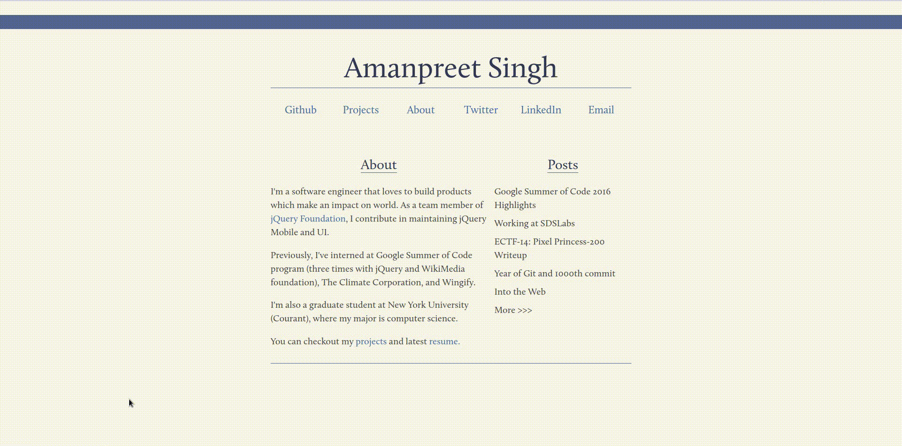

在左边的窗口中我们能看到整个网页的HTML代码及DOM结构。你可以编辑这些元素，并能够实时看到网页的变化。右边的窗口中的"style"面板中能查看对应元素的CSS样式，并可以选择启用/禁用/修改样式，实时看到变化。"computed"面板则能看到计算好的样式，点击对应的样式，会跳转到对应的CSS上，在过多冗余样式的项目中能够可以快速定位到需要修改的样式上。"event listeners"，查看到当前元素的所绑定的事件，方便定位到元素对应事件的js代码上，然后进行下一步调试。"DOM Breakpoints"-DOM的断点调试，在开发中，我们偶尔会遇到页面上的DOM元素被修改了属性，但不知道是哪段js代码的作用。DOM断点就可以帮助我们来解决此类问题。"properties"超级全面地列出当前选中内容的属性，不过基本很少用到。

### Sources - 调试代码

这是常用的面板，可以用来分析、调试和编辑网站的javascript、html和css。

* 一般不是开发模式下的文件都是经过压缩混淆的，点击“pretty print button”可以美化代码，更有可读性。
* 通过直接在文件中修改代码来调试，另外还可以创建新的代码片段，来运行
* 给XHR或者fetch添加断点
* 查看全局事件，给事件监听添加断点
* 像标准调试器一样可以选择 step in、step out和step over 来调试
* 检查函数调用堆栈

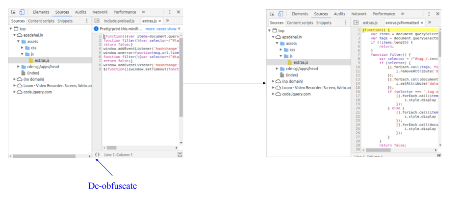
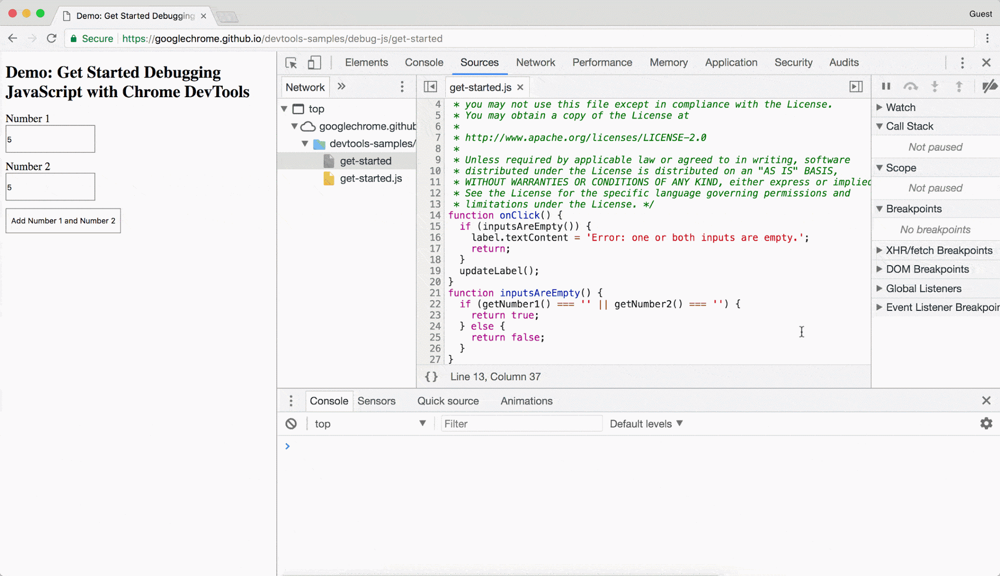
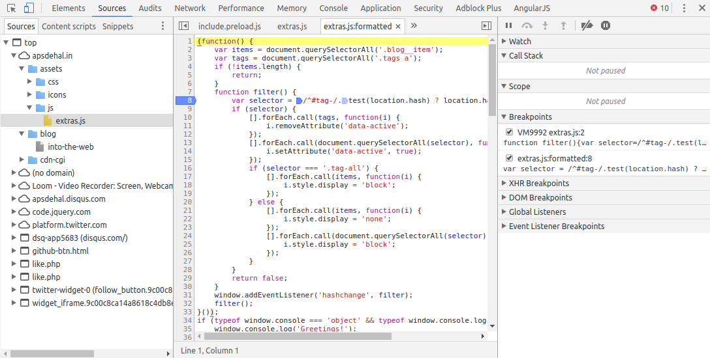

tip: 可以在source面板中按‘esc’调出console面板，进行调试

### Audits - 模拟真实环境测试网页

这个面板可以测试发现分析影响网站性能，可访问性和用户体验的一些列问题。Audits使用Google的lighthouse项目作为后端，通常用来检查网站是否符合Progressive Web App的标准，展示性能指标，建议最佳实现方式和反馈可访问性方面的问题。只需要在Audits运行即可获得对网站的分析结果。

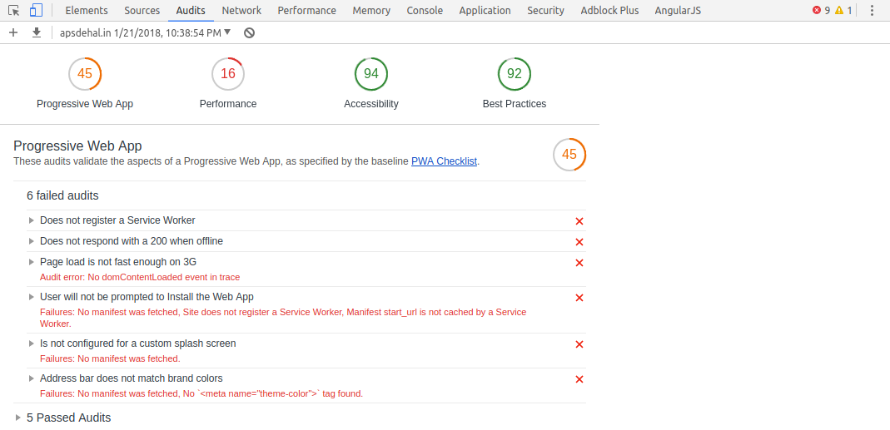

### Network - 优化页面网络加载性能，调试请求

network这个面板经常用于调试任何类型的网络请求。它可以记录下每个请求的请求参数和请求头已经响应主体和响应头，并且可以按类型或域名过滤网络请求。当请求出错时，这个面板将会在第一时间用红色标示错误的请求，并显示对应的http状态码。

面板中其他内容部分和功能
* Timing, 用于显示请求的统计信息，可用于网络请求的性能诊断
* 模拟3G/4G等网络状态下对网站加载速度测试
* 离线情况下对网站测试
* 录制网站截图，获取网页加载过程中网页可视部分的图像
* 禁用网络资源的缓存

tips:
* 右键需要的网络请求就可以选择复制对应的curl链接，这样就可以在终端中使用它 
* 在请求列表的表头上右键可以选择更多的请求的属性，例如使用的协议版本等等

### Application - 检查网站在浏览器缓存的资源

在这个板块，可以管理网站加载的各种资源，包括cookies、local storage、application cache、session storage、web SQL、indexedDB。它可以查看设置或清除这些资源，还能够显示这些资源占用内存大小。

它可以帮助我们完成下面这些任务：
* 检查网页应用的Manifest
* 使用Service Workers 可以用来对service worker进行相关操作，比如停止、离线工作等
* 在Clear storage中查看service worker的缓存
* 用Clear storage清除所有的本地存储、缓存和service worker
* 查看和编辑各种存储和数据库
* 在Web SQL数据库上执行sql语句

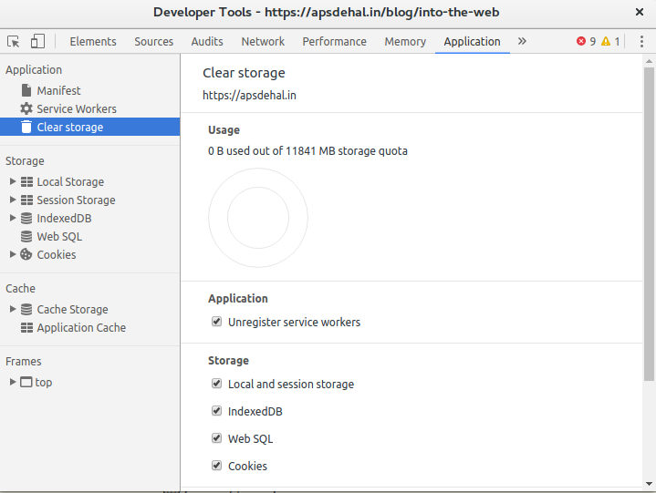

### Performance - 提高页面运行时的性能

这个面板允许我们分析应用程序JavaScript的运行时性能。该面板记录了所有在页面生命周期中发生的各种事件，并显示每个事件花费的时间。选择屏幕截图复选框后，我们可以使用“Capture Settings”中的网络和CPU限制选项来模拟我们的网站在移动设备上的性能。点击“Record”按钮，开始录制网站从当前开始的所有事件。几秒钟后，单击“stop”将停止录制并显示每个事件的结果和时间。根据分析得到的图表来了解网站的哪些部分性能出现下降。将鼠标悬停在某个时间点上就会显示该时间点的屏幕截图，也可以使用鼠标回放记录。

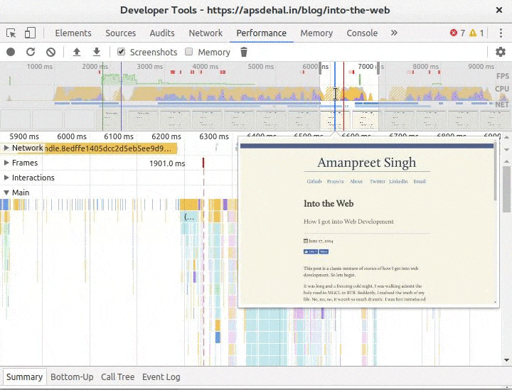

https://segmentfault.com/a/1190000011516068

tip: 你可以通过按下“Command + Shift + P”(Mac)或“Control + Shift + P”(Windows, Linux)来启用FPS meter，在render tabenable FPS meter中输入渲染和选择Show Rendering来显示屏幕右上角的一个叠加，显示FPS。

### Memory - 追踪内存泄漏

使用此面板，我们可以发现在大多数常见场景中影响页面性能的问题，包括内存泄漏和膨胀。
内存面板提供了三种不同类型的分析:

* Heap Snapshot:它可以用来获取堆的快照，其中显示了web站点的JavaScript对象和DOM节点之间的内存分布。可以用来查找可能导致内存泄漏的分离DOM树（搜索‘Detached’）。用红色突出显示的节点是目前没有来自代码的直接引用的，而黄色的节点是有直接引用。红色的只是因为它们是黄色节点树的一部分而存在。特别要注意的是，我们需要关注黄色节点。确保黄色节点的存在时间不超过它需要的时间。

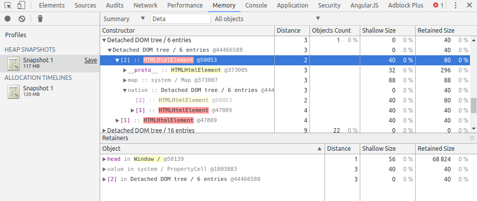

* Record Allocation Timeline:此记录有利于帮助我们跟踪网站JS堆中的内存泄漏。开始录制，执行你怀疑内存泄漏的操作，然后按停止录制。记录中的蓝条代表新的内存分配。这些可能是内存泄漏的内容，可以放大过滤器的格子，然后可以在对象窗格中查看特定对象。

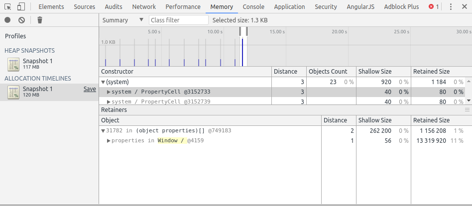

* Record Allocation Profiles:它显示了JavaScript函数的内存分配。与时间轴类似，你可以选择要查看的操作记录配置文件。开发工具将显示每个函数的内存分配。然后，就可以寻找大量使用内存的罪魁祸首。

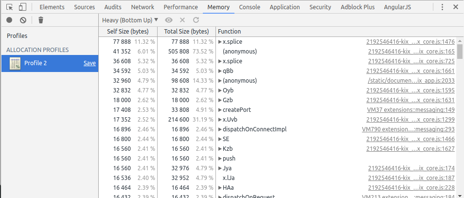

关于js内存分析的解释

https://blog.csdn.net/bug_zero/article/details/54883083

### Security - 检查常见的安全问题

这个相对较新的面板允许我们测试网站以获取最佳的安全措施。它对不同资源的所有源进行测试，以获得有效的SSL证书、安全连接、安全资源和其他东西。在非安全/安全的基础上，可以进一步将起源过滤到不同的类别中，这样可以方便地跟踪问题。只要打开开发工具，选择这个面板，重新加载您的网站，以得到一个分析。

### Console - 记录诊断信息

Console可以被认为是一个实验场。您可以运行访问全局窗口变量的任何JavaScript代码。Console面板还可以作为所有类型错误(与网络和源代码相关的)的日志记录器，并将它们与网站或源代码中出现错误的行号一起显示在一个位置。此外，调试期间可以打开Console面板，检查当前断点的局部变量值。Console面板公开了一个对象“console”，可用于以不同格式记录信息。

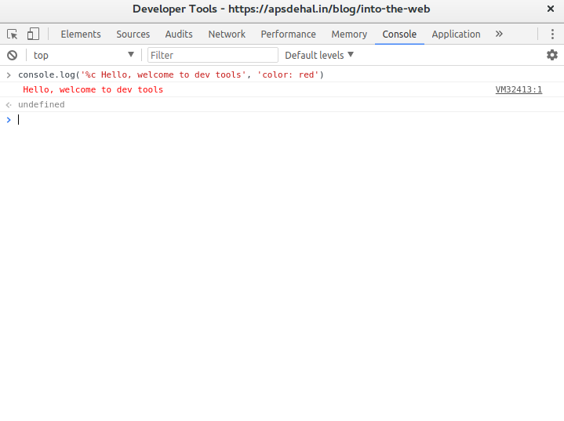

* step in、step out、step over

step into：单步执行，遇到子函数就进入并且继续单步执行（简而言之，进入子函数）；

step over：在单步执行时，在函数内遇到子函数时不会进入子函数内单步执行，而是将子函数整个执行完再停止，也就是把子函数整个作为一步。有一点,经过我们简单的调试,在不存在子函数的情况下是和step into效果一样的（简而言之，越过子函数，但子函数会执行）。

step out：当单步执行到子函数内时，用step out就可以执行完子函数余下部分，并返回到上一层函数。

* DOM 断点

DOM 断点（DOM Breakpoints）可以监听某个 DOM 被修改情况，在Elements中某个元素上右键可以设置子节点修改、自身属性修改和自身节点被删除三种断点。

* call stack

https://blog.csdn.net/qq_31628337/article/details/71056294

* session storage & local storage

https://blog.csdn.net/fcdd123/article/details/56286106

* webSQL & indexedDB

https://www.cnblogs.com/hoboStage/p/5099637.html

* manifest

https://developer.mozilla.org/zh-CN/docs/Web/Manifest

* service worker

https://www.jianshu.com/p/0e2dee4c77bc

