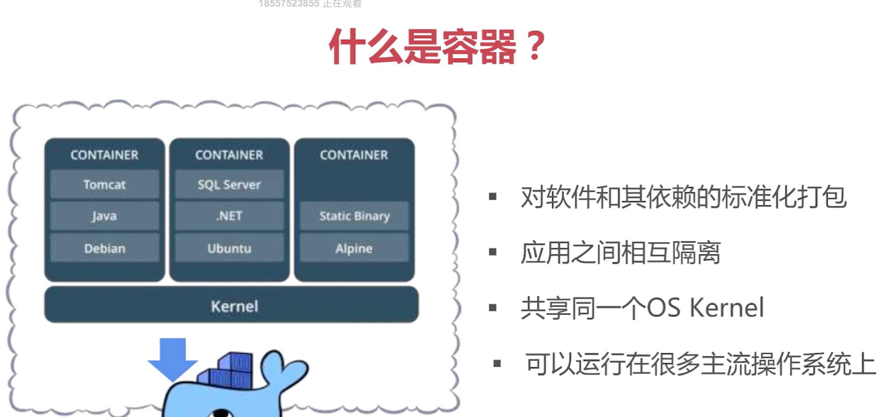

# Docker尝试

## 什么是Docker
Docker是Go语言实现的开源项目，诞生于2013年初。

1. 镜像：
 一个只读的模板，可以是一个操作系统、PHP、Nginx等，镜像是创建Docker容器的基础。

```
docker images
docker pull redis
docker images
```

2. 容器：
类似于一个轻量级的沙箱，容器是从镜像创建的应用运行实例

Docker容器是在操作系统层面实现虚拟化，直接复用本地主机的操作系统，因此更佳轻量级。
```
docker create -it redis
docker start containerId
docker exec -it containerId /bin/bash
docker stop conttainerId
```

## Docker相对于虚拟机的优点？


1. 更高效的资源利用：每个虚拟机都是一个完整的操作系统，需要单独分配内存、磁盘等资源，当虚拟机数量增多时，操作系统本身消耗的资源也随之增多。而Docker是内核级的虚拟化，可以实现更高效的性能，只需要启动几个隔离的容器，并将应用放入容器即可。

2. 其他如启动速度快（秒级别）、性能接近原生、内存代价小、硬盘使用量少、迁移性高

## Dockerfile
```
FROM nginx
EXPOSE 8899
```
## Docker Compose
* 一个项目往往需要创建多个Container（如Nginx、Mysql、PHP、Redis等等），如果通过docker build/start/stop等命令一个个管理容器，将十分麻烦。
* Docker Compose 让用户编写单独的docker-compose.yml模板文件来定义一组相关关联的应用容器为一个项目，通过一条命令就可以创建和管理多个容器。

```
version: '3'

services:

  wordpress:
    image: wordpress
    ports:
      - 8080:80
    environment:
      WORDPRESS_DB_HOST: mysql
      WORDPRESS_DB_PASSWORD: root
    networks:
      - my-bridge

  mysql:
    image: mysql
    environment:
      MYSQL_ROOT_PASSWORD: root
      MYSQL_DATABASE: wordpress
    volumes:
      - mysql-data:/var/lib/mysql
    networks:
      - my-bridge

volumes:
  mysql-data:

networks:
  my-bridge:
    driver: bridge
```

## Docker 实际为我解决什么问题？
**痛点：** 开发环境与生产环境不一致问题；开发环境和生产环境需要分别安装环境；多人开发时很难保证所有人的开发环境一致（如增加扩展等）；

**docker解决了这些问题**，一个Dockerfile文件即一个服务或者应用，一个docker-compose.yml文件可以维护一个复杂的项目（多容器）。通过维护这些文件实现高效的容器管理。

## 项目实例
* 使用开源项目laradock构建一个应用

## 相关链接
* Docker 官方文档：[https://docs.docker.com/](https://docs.docker.com/)
* Docker Hub：[https://hub.docker.com/](https://hub.docker.com/)
* k8s: [https://kubernetes.io/](https://kubernetes.io/)