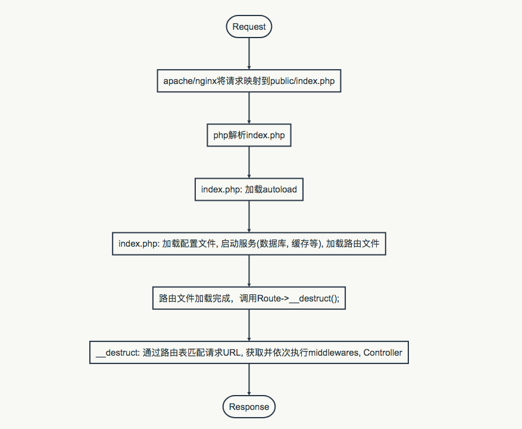

# PHP框架基础
## Composer
- 依赖管理
- 自动加载
```C
vendor/
```

## 单入口
```C
public/
|-- index.php
```
- 安全
- URL美观
- 路由方便

## 路由
###  概括
发送者和接收者遵守相同的一套规则，确保接收者可以准确接收发送者消息的通路。
规则 -> 路由表
通路 -> 路由
通路中的关卡 ->  中间件

### 代码实现
路由表: 设置可识别的规则文本；
路由: 匹配规则并产生通路和关卡，传递消息。

路由类
```php
<?php
namespace Conveyor;

class Route {
    public static $routes = array();           // uri
    public static $methods = array();       // get/post
    public static $callbacks = array();      // func
    public static $middlewares = array(); // middleware
    public static $error_callback;             // err func
    public static $object = null;

    public static function __callstatic($method, $params)
    {
        // 一些取值赋值操作
        array_push(self::$routes, $uri);
        array_push(self::$methods, strtoupper($method));
        array_push(self::$callbacks, $callback);
        array_push(self::$middlewares, $middleware);

        return self::instance();
    }

    public function __destruct()
    {
        self::dispatch();
    }

    protected static function instance()
    {
        if (is_null(self::$object)) {
            self::$object = new Route();
        }

        return self::$object;
    }

    protected static function dispatch()
    {
        // 路由匹配
        // 实例化中间件类并调用类方法
        // 实例化controller类并调用类方法
        // 返回结果
    }
```
路由表
```
route/
|-- web.php
```
web.php
```php
<?php

use Conveyor\Route;

Route::get('/', function () {
    echo 'hello world';
});
Route::group(['prefix' => '/sub1', 'namespace' => 'App\\Controller\\', 'middleware' => 'foo, bar'], function() {
    Route::get('/', function() {
        return 'I can receive uri like /user/sub1';
    });
    Route::get('/abc', 'DemoController@method'); });
});
```


index.php
```php
<?php

// Autoload 自动载入
require_once __DIR__ . '/../vendor/autoload.php';

// 路由配置
require_once __DIR__ . '/../route/web.php';
```

## MVC
```c
app/
|-- Controllers/
|-- Models/
|-- Middlewares/
|-- Views/
```
composer.json
```json
    "autoload": {
        "psr-4": {
            "App\\": "app/"
        }
    }
```

### Controller
路由传递消息的终点；负责接收消息，处理，和返回结果。

### Model
数据库交互，数据汇总或更新，供controller调用。
```c
database/
config/
|-- database.php
```

index.php
```php
<?php

// Autoload 自动载入
require_once __DIR__ . '/../vendor/autoload.php';

// Eloquent ORM
$Capsule = new Capsule;
$Capsule->addConnection(config('database.dev'));
$Capsule->setAsGlobal();  //make DB::foo,bar, like `DB:raw()` callable;
$Capsule->bootEloquent();

// 路由配置
require_once __DIR__ . '/../route/web.php';
```

### View
定义模版，填充变量，渲染页面并返回。
app/Controllers/DemoController.php
```php
<?php

namespace App\Controllers;

use OneViewPackage\View;

class DemoController
{
    public function article()
    {
        return View::make('article.index')
            ->withTitle('abc')
            ->withYear('2018');
    }
}
```

## 文件结构
```c
root/
|-- app/
    |-- Controllers/
    |-- Models/
    |-- Middlewares/
|-- config/
    |-- database.php
|-- database/
    |-- *.sql
|-- public/
    |-- css/
    |-- js/
    |-- index.php
|-- route/
    |-- web.php
|-- vendor/
```
## 应用流程


## 参考文献
[Composer](https://lvwenhan.com/php/405.html)
[Route](https://github.com/arnoluo/conveyor)
[Framework](https://github.com/arnoluo/sojourn)
