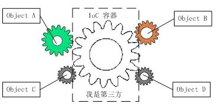

# 控制反转、依赖注入和IoC容器

## 1、最基本的数据库连接方法

```
class DB{
    public function setDriver(){
        return new mysql();
    }
}

class mysql{
    public function connect(){
        echo '连接mysql';
    }
}

$DB = new DB();
$DB->setDriver()->connect();

```

以上的代码会导致应用程序对低层的模块产生依赖，也就是耦合度比较高，如果要改用别的数据库系统，就要去改动DB类的代码，扩展性不好。

## 2、稍加改进的“工厂模式”
```

class DBFactory{
    public function setDriver($type){
        if ($type == 'mysql') {
            return new mysql();
        } else {
            return new oracle();
        }
    }
}

class mysql{
    public function connect(){
        echo '连接mysql';
    }
}

class oracle{
    public function connect(){
        echo '连接oracle';
    }
}

$DB = new DBFactory();
$DB->setDriver('mysql')->connect();
```
简单工厂模式虽然对于第一条下的代码做了一些改进，但是还是不能满足需求。比如说在想加一条生产线的话还是要动DBFactory类下的源码。

## 3、通过依赖注入和控制反转进行改进
```
/**
 *  数据库链接接口
 */
interface InterfaceDB{
    public function connect();
}

/**
 *  mysql数据库
 */
class mysql implements InterfaceDB{
    public function connect(){
        echo '连接mysql';
    }
}

/**
 *  oracle数据库
 */
class oracle implements InterfaceDB{
    public function connect(){
        echo '连接oracle';
    }
}

/**
 *  数据库连接类(需要注入数据库类型依赖)
 */
class DB{
    private $db;
    
    public function __construct(InterfaceDB $type){
        $this->db = $type;
    }
    public function connect(){
        $this->db->connect();
    }
}

// 制造mysql数据库
$db = new DB(new mysql());
$db->connect();
```

注：只要不是由内部生产（比如初始化、构造函数 __construct 中通过工厂方法、自行手动 new 的），而是由外部以参数或其他形式注入的，都属于依赖注入（DI），控制反转是一个抽象的概念。说白了就是一个对象如何去获取他所依赖的对象的引用的方法。依赖注入(Dependency Injection)是一个常用的方法。

如上，就是将DB类调用具体哪个类(mysql or oracle)的控制权从其中移除，实现了控制的“反转”，控制权从实际的mysql转移到了InterfaceDB接口上，让DB只依赖于这个接口，而不依赖于具体的实现。即使如此，其实还是有很多弊端的。比如：实例化DB类的时候需要手动注入依赖，如果想弄一个Cache类的话，就得全部重新写一套，并且写法也得改成new Cache(new 依赖())。


## 4、IoC容器“超级工厂模式”

```
/**
 *  超能力制造接口
 */
interface superManAbility{
    public function attack();
}

/**
 *  制造核弹打击超能力
 */
class NBomb implements superManAbility{
	public function attack(){
		echo '核弹精准打击！';
	}
}

/**
 *  超人类(需要注入超能力类)
 */
class SuperMan{
	protected $ability;
	
	public function __construct(superManAbility $ability) {
		$this->ability = $ability;
	}
	
	public function attack(){
		$this->ability->attack();
	}
}

/**
 *  IoC容器
 */
class IoC{
	protected static $reg = [];

	public static function bind($factoryName, $dependencyName){
		// 建立工厂类的反射类
		$reflect = new ReflectionClass($factoryName);
		// 获取工厂类的构造方法
		$constructor = $reflect->getConstructor();
		// 获取工厂类构造方法里的依赖类的名称
		$name = $constructor->getParameters()[0]->getClass()->name;
		// 实例化第二参数
		$dependencyClass = new $dependencyName;
		if ($dependencyClass instanceof $name) {
			static::$reg[$factoryName] = $reflect->newInstance($dependencyClass);
		} else {
			echo '依赖参数不合法！';
		}
	}
	
	public static function getInstance($name){
		if (isset(static::$reg[$name])) {
			return static::$reg[$name];
		} else {
			echo 'error';
		}
	}
}

// 制造核弹打击的超人
IoC::bind('SuperMan', 'NBomb');
IoC::getInstance('SuperMan')->attack();

// 制造连接mysql的数据库连接类
IoC::bind('DB', 'mysql');
IoC::getInstance('DB')->connect();
```
到此为止，IoC容器基本已经介绍完毕了，此时不论是使用数据库连接类、超人制造类、Cache类都可以通过统一的接口调用，依赖的注入也已经从手动注入转换成了自动注入了。


## 4、总结

如下图，通过引入的“第三方”，也就是IoC容器，使得A、B、C、D这4个对象没有了耦合关系，齿轮之间的传动全部依靠“第三方”了，全部对象的控制权全部上缴给“第三方”IoC容器，所以，IoC容器成了整个系统的关键核心，它起到了一种类似“粘合剂”的作用，把系统中的所有对象粘合在一起发挥作用，如果没有这个“粘合剂”，对象与对象之间会彼此失去联系，这就是有人把IOC容器比喻成“粘合剂”的由来。



## 参考资料
1、java开发者写的解释ioc和di的博客：http://blog.xiaohansong.com/2015/10/21/IoC-and-DI/

2、laravel学院的文章，超人部分的代码就是出自这里的：http://laravelacademy.org/post/769.html

3、http://codezye.com/2015/11/19/设计模式-工厂模式和ioc控制反转（二）/

