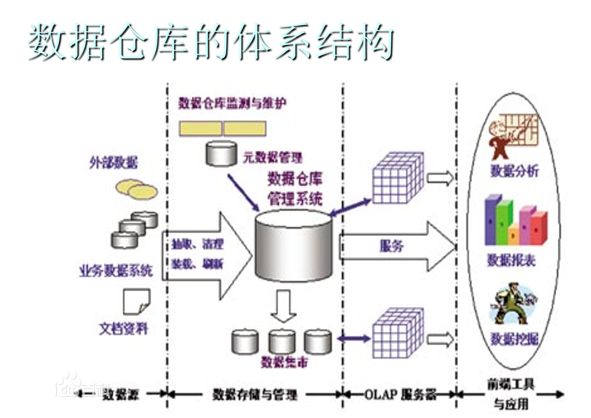
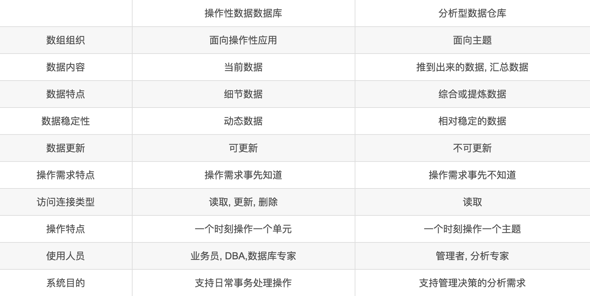
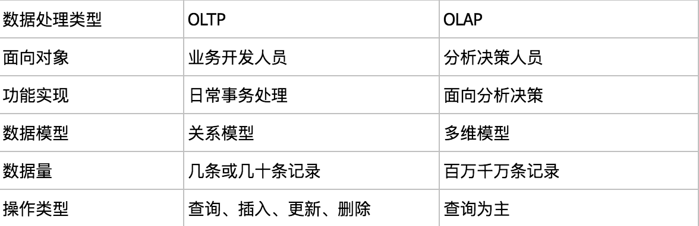

# 数据仓库
数据仓库，英文名称为Data Warehouse，可简写为DW或DWH。数据仓库，是为企业所有级别的决策制定过程，提供所有类型数据支持的战略集合。它是单个数据存储，出于分析性报告和决策支持目的而创建。 为需要业务智能（Business Intelligence）的企业，提供指导业务流程改进、监视时间、成本、质量以及控制。
数据仓库 ，由数据仓库之父比尔·恩门（Bill Inmon）于1990年提出，主要功能仍是将组织透过资讯系统之联机事务处理(OLTP)经年累月所累积的大量资料，透过数据仓库理论所特有的资料储存架构，作一有系统的分析整理，以利各种分析方法如联机分析处理(OLAP)、数据挖掘(Data Mining)之进行，并进而支持如决策支持系统(DSS)、主管资讯系统(EIS)之创建，帮助决策者能快速有效的自大量资料中，分析出有价值的资讯，以利决策拟定及快速回应外在环境变动，帮助建构商业智能(BI)。
数据仓库之父比尔·恩门（Bill Inmon）在1991年出版的“Building the Data Warehouse”（《建立数据仓库》）一书中所提出的定义被广泛接受——数据仓库（Data Warehouse）是一个面向主题的（Subject Oriented）、集成的（Integrated）、相对稳定的（Non-Volatile）、反映历史变化（Time Variant）的数据集合，用于支持管理决策(Decision Making Support)。

### 与操作性数据库的区别

### OLTP与OLAP
联机事务处理OLTP（on-line transaction processing） 主要是执行基本日常的事务处理，比如数据库记录的增删查改。比如在银行的一笔交易记录，就是一个典型的事务。
联机分析处理OLAP（On-Line Analytical Processing） 是数据仓库系统的主要应用，支持复杂的分析操作，侧重决策支持，并且提供直观易懂的查询结果。
OLTP:
1.实时性要求高。
2.数据量不是很大，生产库上的数据量一般不会太大，而且会及时做相应的数据处理与转移。
3.交易一般是确定的，比如银行存取款的金额肯定是确定的，所以OLTP是对确定性的数据进行存取
4.高并发，并且要求满足ACID原则。比如两人同时操作一个银行卡账户，比如大型的购物网站秒杀活动时上万的QPS请求
OLAP:
1.实时性要求不是很高，比如最常见的应用就是天级更新数据，然后出对应的数据报表。
2.数据量大，因为OLAP支持的是动态查询，所以用户也许要通过将很多数据的统计后才能得到想要知道的信息，例如时间序列分析等等，所以处理的数据量很大;
3.OLAP系统的重点是通过数据提供决策支持，所以查询一般都是动态，自定义的。所以在OLAP中，维度的概念特别重要。一般会将用户所有关心的维度数据，存入对应数据平台。

## 数据模型

### 多维数据模型
维度表 事实表

在多维数据仓库中，保存度量值的详细值或事实的表称为“事实表”。事实数据表通常包含大量的行。事实数据表的主要特点是包含数字数据（事实），并且这些数字信息可以汇总，以提供有关单位作为历史的数据，每个事实数据表包含一个由多个部分组成的索引，该索引包含作为外键的相关性纬度表的主键，而维度表包含事实记录的特性。事实数据表不应该包含描述性的信息，也不应该包含除数字度量字段及使事实与纬度表中对应项的相关索引字段之外的任何数据。
维度表维度表可以看作是用户来分析数据的窗口，纬度表中包含事实数据表中事实记录的特性，有些特性提供描述性信息，有些特性指定如何汇总事实数据表数据，以便为分析者提供有用的信息，维度表包含帮助汇总数据的特性的层次结构。例如，包含产品信息的维度表通常包含将产品分为食品、饮料、非消费品等若干类的层次结构，这些产品中的每一类进一步多次细分，直到各产品达到最低级别。

### 星型模式（star schema）

### 雪花模式（snowflake schema）

### 星系模式（galaxy schema）

### 维度与OLAP
OLAP（On-line Analytical Processing，联机分析处理）是在基于数据仓库多维模型的基础上实现的面向分析的各类操作的集合.
对分析需要的数据进行有效集成，按多维模型予以组织，以便进行多角度、多层次的分析，并发现趋势。其具体实现可以分为：ROLAP（关系型在线分析处理）、MOLAP（多维在线分析处理）和HOLAP（混合型线上分析处理）。ROLAP基本数据和聚合数据均存放在RDBMS之中；MOLAP基本数据和聚合数据均存放于多维数据库中；HOLAP基本数据存放于RDBMS之中，聚合数据存放于多维数据库中。

